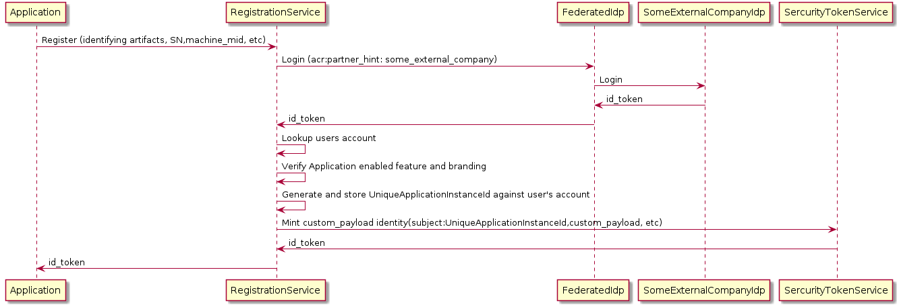

# Deeply Nested Identity

Sometimes a simple claim;
```
{role:"admin"}
```
is simply not enough.

JWTs allow for what appears to be a claim the looks like the following;
```
{
	"custom_payload": {
		"some_string": "data",
		"some_number": 1234,
		"some_object": {
			"some_string": "data",
			"some_number": 1234
		},
		"some_array": [{
			"a": "b"
		}, {
			"b": "c"
		}]
	}
}
``` 

The following is basically and IoT registration where the IoT is a highly configurable application.  In this case the application has a lot of features that can be turned on and off and whitebox branded to a given partner.

When the application starts up it gathers a bunch of identifying information.  Everything from the applications SKU, OS information, and injected partner data that came with the initial install.  

On the surface this is a variation on a licensing model where usually a digitally signed XML or JWS is passed to the client application.
These licensing packages are id_tokens and certainly not an access_token.  Its telling the application who they are given hardened marching orders.
Since a JWT is a JWS then this licensing package is an id_token.


The following [POC call](https://p7identityserver4.azurewebsites.net/docs/arbitrary_identity.md) is used to mint and arbitrarily large id_token

 


# REQUEST
```
https://p7identityserver4.azurewebsites.net/connect/token
HEADERS:
  Content-Type:application/x-www-form-urlencoded
BODY:
	grant_type:arbitrary_identity
	client_id:arbitrary-resource-owner-client
	client_secret:secret
	scope:registration_service
	subject:uniqueApplicationId:886bea3f-e025-4ab9-a811-e9b86f563668
	access_token_lifetime:3600
	custom_payload: {↵	"mid": "windows-10-1324233",↵	"partnerInformation": {↵		"brandingPackage": "https://some.cdn.net/partner/1234/branding.zip"↵	},↵	"features": [{↵			"a": "disabled"↵		},↵		{↵			"b": "enabled"↵		},↵		{↵			"c": "enabled"↵		},↵		{↵			"d": "level:3"↵		}↵	]↵} 	 
```
# RESPONSE
```
{
    "id_token": "eyJhbGciOiJSUzI1NiIsImtpZCI6IkZENkFGOTIyQTAyNTM4NzE5RjhBQjVBRTM0NjdCMjA1MEU2QUExMkUiLCJ0eXAiOiJKV1QiLCJ4NXQiOiJfV3I1SXFBbE9IR2Zpcld1TkdleUJRNXFvUzQifQ.eyJuYmYiOjE1NDM3NjUwMTYsImV4cCI6MTU0Mzc2NTMxNiwiaXNzIjoiaHR0cHM6Ly9wN2lkZW50aXR5c2VydmVyNC5henVyZXdlYnNpdGVzLm5ldCIsImF1ZCI6ImFyYml0cmFyeS1yZXNvdXJjZS1vd25lci1jbGllbnQiLCJpYXQiOjE1NDM3NjUwMTYsImF0X2hhc2giOiJONjR3S2tRRVJCekFmS3ZWRFdkZFl3Iiwic3ViIjoidW5pcXVlQXBwbGljYXRpb25JZDo4ODZiZWEzZi1lMDI1LTRhYjktYTgxMS1lOWI4NmY1NjM2NjgiLCJhdXRoX3RpbWUiOjE1NDM3NjUwMTYsImlkcCI6ImxvY2FsIiwiY2xpZW50X25hbWVzcGFjZSI6IkRhZmZ5IER1Y2siLCJhbXIiOlsiYXJiaXRyYXJ5X2lkZW50aXR5Il0sImN1c3RvbV9wYXlsb2FkIjp7Im1pZCI6IndpbmRvd3MtMTAtMTMyNDIzMyIsInBhcnRuZXJJbmZvcm1hdGlvbiI6eyJicmFuZGluZ1BhY2thZ2UiOiJodHRwczovL3NvbWUuY2RuLm5ldC9wYXJ0bmVyLzEyMzQvYnJhbmRpbmcuemlwIn0sImZlYXR1cmVzIjpbeyJhIjoiZGlzYWJsZWQifSx7ImIiOiJlbmFibGVkIn0seyJjIjoiZW5hYmxlZCJ9LHsiZCI6ImxldmVsOjMifV19fQ.pENSqx5NP0vZDVlXlixtjtByZBMxw7YcLYhqVs0MrkAC4DS34e9DTmRjZN1uLwkUJOqHcEslZ6BvAcMzNZgqBwqek_RAQmLT2bZiqNYferxHt102F1MNe86Mfd2xXQhYPrjURK2wnaGffItDax_ORuTrooE94ptmAPLQWrFxhwMc5pvE23JGsq-pPD4DzefZj-oe53gb6C0aZ1JyYuUqPahptJKgI8P6tW1dbGx_-SrdQfUZXGk6Kla0en5vEixKWcZxc2t1NIc70IzDWoY6Y2Qh-RGnICaUTJbWphEWBtFIVvawOXpNHT4wMa1mINPvTGI194I2O_q4qYhdjxRtpw",
    "access_token": "eyJhbGciOiJSUzI1NiIsImtpZCI6IkZENkFGOTIyQTAyNTM4NzE5RjhBQjVBRTM0NjdCMjA1MEU2QUExMkUiLCJ0eXAiOiJKV1QiLCJ4NXQiOiJfV3I1SXFBbE9IR2Zpcld1TkdleUJRNXFvUzQifQ.eyJuYmYiOjE1NDM3NjUwMTYsImV4cCI6MTU0Mzc2ODYxNiwiaXNzIjoiaHR0cHM6Ly9wN2lkZW50aXR5c2VydmVyNC5henVyZXdlYnNpdGVzLm5ldCIsImF1ZCI6WyJodHRwczovL3A3aWRlbnRpdHlzZXJ2ZXI0LmF6dXJld2Vic2l0ZXMubmV0L3Jlc291cmNlcyIsInJlZ2lzdHJhdGlvbl9zZXJ2aWNlIl0sImNsaWVudF9pZCI6ImFyYml0cmFyeS1yZXNvdXJjZS1vd25lci1jbGllbnQiLCJzdWIiOiJ1bmlxdWVBcHBsaWNhdGlvbklkOjg4NmJlYTNmLWUwMjUtNGFiOS1hODExLWU5Yjg2ZjU2MzY2OCIsImF1dGhfdGltZSI6MTU0Mzc2NTAxNiwiaWRwIjoibG9jYWwiLCJjbGllbnRfbmFtZXNwYWNlIjoiRGFmZnkgRHVjayIsInNjb3BlIjpbInJlZ2lzdHJhdGlvbl9zZXJ2aWNlIl0sImFtciI6WyJhcmJpdHJhcnlfaWRlbnRpdHkiXSwiY3VzdG9tX3BheWxvYWQiOnsibWlkIjoid2luZG93cy0xMC0xMzI0MjMzIiwicGFydG5lckluZm9ybWF0aW9uIjp7ImJyYW5kaW5nUGFja2FnZSI6Imh0dHBzOi8vc29tZS5jZG4ubmV0L3BhcnRuZXIvMTIzNC9icmFuZGluZy56aXAifSwiZmVhdHVyZXMiOlt7ImEiOiJkaXNhYmxlZCJ9LHsiYiI6ImVuYWJsZWQifSx7ImMiOiJlbmFibGVkIn0seyJkIjoibGV2ZWw6MyJ9XX19.Ye894Z1re_LkKzQsOGSlc-_huXtJ3vGHNlvrRHHTGIkWBTFkNy-sGliwTDcBt4XLmmGjH5BmnT7Lr398eqeIg5KYDAvW3G5Om9Plp6e4E1vMYjIyqOSr4Ni4LbLUquRYUxE7wJq-69AYPWa62CqtleUq8e2mOISNHjp78JSAr1qIlC6aS81NhtuR5tiuOPi0X0zHWCcPtBufAvYQtaJEqIfSh34KUYlhtaQFDFrERaifjovCdgMCajqHnPnFKTv4RXpLqhwqy3ZmqVU7HM4bACH9q709vraXBg5H1u39_nKhvDOPe6NY-lrTIUSMM6GeWSohAuh7zbc4oFhk-HiEfQ",
    "expires_in": 3600,
    "token_type": "Bearer"
}
```


# PLANTUML 
```
@startuml
MobileApp -> FederatedIdp: Login
MobileApp <- FederatedIdp: id_token
== time ==
MobileApp->SomeService: Bind(id_token)
SomeService->SomeService: Validate(id_token)
SomeService->SomeService: Lookup User and Build Claims
SomeService->SercurityTokenService: Mint resource owner access_token (subject:userId,claims, etc)
SomeService<-SercurityTokenService: access_token,refresh_token
MobileApp<-SomeService: access_token,refresh_token
== time ==
MobileApp->SomeService: /Some/Api  Authorization: Bearer {{access_token}}
SomeService->SomeService: Validate(access_token)
MobileApp<-SomeService: {"data":{}}
== time ==
MobileApp->SercurityTokenService: /connect/token grant_type:refresh {{refresh_token}}
MobileApp<-SercurityTokenService: access_token,refresh_token
== time ==
SomeService->SercurityTokenService: /revocation subject=userId
@enduml
```
