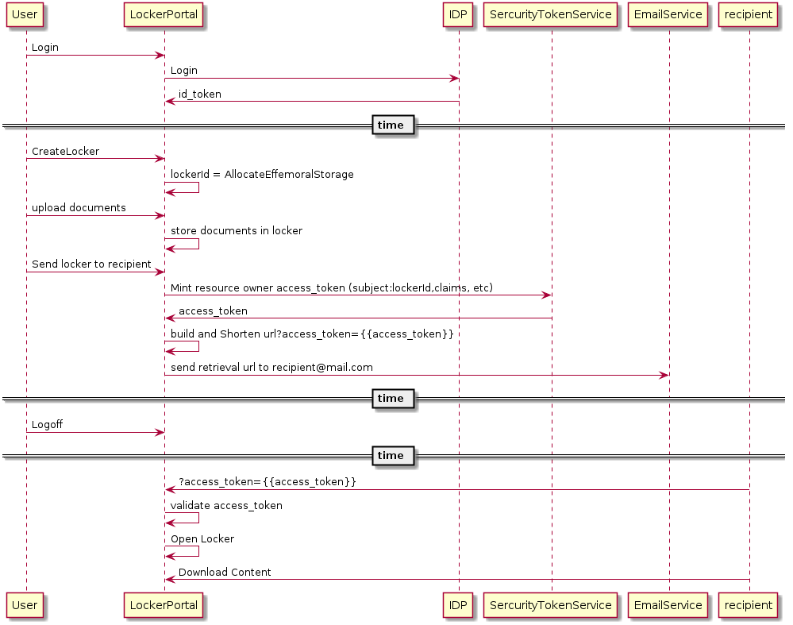

# Effemoral Storage Usecase
This is modeled on a real world scenario, where Amazon suggests that you use an effemoral locker at WholeFoods as your shipping address.
Arguable they really want to do this so you buy overpriced cheese, but for those of us that have porch theives its a nice service.

# Ask
I would like to store documents in a effemoral cloud locker and send the unlock code via email to a recipient;
The locker has a TTL and upon expiration it and its contents evaporate.

The following [POC call](https://p7identityserver4.azurewebsites.net/docs/arbitrary_resource_owner.md) is used to mint the access_token to the locker.

[sequence diagram](http://liveuml.com/diagram/view/5c02b01937ecd3087ea64b1c)


# REQUEST
```
https://p7identityserver4.azurewebsites.net/connect/token
HEADERS:
  Content-Type:application/x-www-form-urlencoded
BODY:
  grant_type:arbitrary_resource_owner
  client_id:arbitrary-resource-owner-client
  client_secret:secret
  scope:locker_portal
  arbitrary_claims:{"role": ["read-only"]}
  subject:locker_id:1234
  access_token_lifetime:3600
```
# RESPONSE
```
{
    "access_token": "eyJhbGciOiJSUzI1NiIsImtpZCI6IkZENkFGOTIyQTAyNTM4NzE5RjhBQjVBRTM0NjdCMjA1MEU2QUExMkUiLCJ0eXAiOiJKV1QiLCJ4NXQiOiJfV3I1SXFBbE9IR2Zpcld1TkdleUJRNXFvUzQifQ.eyJuYmYiOjE1NDM2ODIxNDgsImV4cCI6MTU0MzY4NTc0OCwiaXNzIjoiaHR0cHM6Ly9wN2lkZW50aXR5c2VydmVyNC5henVyZXdlYnNpdGVzLm5ldCIsImF1ZCI6WyJodHRwczovL3A3aWRlbnRpdHlzZXJ2ZXI0LmF6dXJld2Vic2l0ZXMubmV0L3Jlc291cmNlcyIsImxvY2tlcl9wb3J0YWwiXSwiY2xpZW50X2lkIjoiYXJiaXRyYXJ5LXJlc291cmNlLW93bmVyLWNsaWVudCIsInN1YiI6ImxvY2tlcl9pZDoxMjM0IiwiYXV0aF90aW1lIjoxNTQzNjgyMTQ4LCJpZHAiOiJsb2NhbCIsInJvbGUiOiJyZWFkLW9ubHkiLCJjbGllbnRfbmFtZXNwYWNlIjoiRGFmZnkgRHVjayIsInNjb3BlIjpbImxvY2tlcl9wb3J0YWwiXSwiYW1yIjpbImFyYml0cmFyeV9yZXNvdXJjZV9vd25lciJdfQ.Ipgj_-NWoYxS297jNwUY62VEuaLExOlxQxsawmQDfFo7QuLI9DoUYkIq-ZziP_r-xU45-5mQKDKZokwAxnexnpvuRNlHujRX4GsHke08PWbzhlKTtUsZEjlxk1ZFH-84LIRkEZspswq9BgxCgGig9bzbHE08Kcmo6XPhavkb3o3NMw4xmErLYMLaoPSTWlQ23lc1P6uamCrsjfPXP_qNJaHFnjVE9OztXfNfJvy_5TcqSxN8kW-3_6_NhYJ28HrKy8TOmqeWykPb1Xsrr8fxZiT7B3R4De6haILiBlFcYxwtuoPGnl1XBRF0GNwAaxjnQg6r-30eRyynPwW1lKUhDw",
    "expires_in": 3600,
    "token_type": "Bearer"
}
```

# PLANTUML 
```
@startuml
User -> LockerPortal: Login
LockerPortal->IDP: Login
LockerPortal<-IDP: id_token
== time ==
User->LockerPortal: CreateLocker
LockerPortal->LockerPortal: lockerId = AllocateEffemoralStorage
User->LockerPortal: upload documents
LockerPortal->LockerPortal: store documents in locker
User->LockerPortal: Send locker to recipient

LockerPortal->SercurityTokenService: Mint resource owner access_token (subject:lockerId,claims, etc)
LockerPortal<-SercurityTokenService: access_token
LockerPortal->LockerPortal: build and Shorten url?access_token={{access_token}}
LockerPortal->EmailService: send retrieval url to recipient@mail.com
== time ==
User -> LockerPortal: Logoff
== time ==

recipient->LockerPortal: ?access_token={{access_token}}
LockerPortal->LockerPortal: validate access_token
LockerPortal->LockerPortal: Open Locker
recipient->LockerPortal: Download Content
@enduml
```


