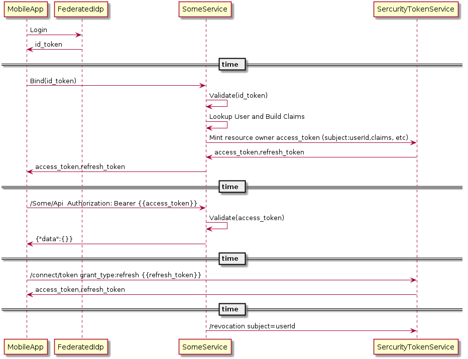

# IDP-SomeService Bearer Token Flow 

In this use case a mobile app logins in a user via a federated IDP.  The only thing requested is an identity.  There is no intent.
Later the MobileApp intends to call a gated service and must trade in a valid id_token for access_tokens to the service.
The FederatedIDP has no knowledge of the final intent.  The service is the only entity that makes an association between an identity and the allowed services.

The following [POC call](https://p7identityserver4.azurewebsites.net/docs/arbitrary_resource_owner.md) is used to mint the access_token to the locker.

 


# REQUEST
```
https://p7identityserver4.azurewebsites.net/connect/token
HEADERS:
  Content-Type:application/x-www-form-urlencoded
BODY:
  grant_type:arbitrary_resource_owner
  client_id:arbitrary-resource-owner-client
  client_secret:secret
  scope:locker_portal
  arbitrary_claims:{"role": ["read-only"]}
  subject:locker_id:1234
  access_token_lifetime:3600
```
# RESPONSE
```
{
    "access_token": "eyJhbGciOiJSUzI1NiIsImtpZCI6IkZENkFGOTIyQTAyNTM4NzE5RjhBQjVBRTM0NjdCMjA1MEU2QUExMkUiLCJ0eXAiOiJKV1QiLCJ4NXQiOiJfV3I1SXFBbE9IR2Zpcld1TkdleUJRNXFvUzQifQ.eyJuYmYiOjE1NDM2ODIxNDgsImV4cCI6MTU0MzY4NTc0OCwiaXNzIjoiaHR0cHM6Ly9wN2lkZW50aXR5c2VydmVyNC5henVyZXdlYnNpdGVzLm5ldCIsImF1ZCI6WyJodHRwczovL3A3aWRlbnRpdHlzZXJ2ZXI0LmF6dXJld2Vic2l0ZXMubmV0L3Jlc291cmNlcyIsImxvY2tlcl9wb3J0YWwiXSwiY2xpZW50X2lkIjoiYXJiaXRyYXJ5LXJlc291cmNlLW93bmVyLWNsaWVudCIsInN1YiI6ImxvY2tlcl9pZDoxMjM0IiwiYXV0aF90aW1lIjoxNTQzNjgyMTQ4LCJpZHAiOiJsb2NhbCIsInJvbGUiOiJyZWFkLW9ubHkiLCJjbGllbnRfbmFtZXNwYWNlIjoiRGFmZnkgRHVjayIsInNjb3BlIjpbImxvY2tlcl9wb3J0YWwiXSwiYW1yIjpbImFyYml0cmFyeV9yZXNvdXJjZV9vd25lciJdfQ.Ipgj_-NWoYxS297jNwUY62VEuaLExOlxQxsawmQDfFo7QuLI9DoUYkIq-ZziP_r-xU45-5mQKDKZokwAxnexnpvuRNlHujRX4GsHke08PWbzhlKTtUsZEjlxk1ZFH-84LIRkEZspswq9BgxCgGig9bzbHE08Kcmo6XPhavkb3o3NMw4xmErLYMLaoPSTWlQ23lc1P6uamCrsjfPXP_qNJaHFnjVE9OztXfNfJvy_5TcqSxN8kW-3_6_NhYJ28HrKy8TOmqeWykPb1Xsrr8fxZiT7B3R4De6haILiBlFcYxwtuoPGnl1XBRF0GNwAaxjnQg6r-30eRyynPwW1lKUhDw",
    "expires_in": 3600,
    "token_type": "Bearer"
}
```

# PLANTUML 
```
@startuml
MobileApp -> FederatedIdp: Login
MobileApp <- FederatedIdp: id_token
== time ==
MobileApp->SomeService: Bind(id_token)
SomeService->SomeService: Validate(id_token)
SomeService->SomeService: Lookup User and Build Claims
SomeService->SercurityTokenService: Mint resource owner access_token (subject:userId,claims, etc)
SomeService<-SercurityTokenService: access_token,refresh_token
MobileApp<-SomeService: access_token,refresh_token
== time ==
MobileApp->SomeService: /Some/Api  Authorization: Bearer {{access_token}}
SomeService->SomeService: Validate(access_token)
MobileApp<-SomeService: {"data":{}}
== time ==
MobileApp->SercurityTokenService: /connect/token grant_type:refresh {{refresh_token}}
MobileApp<-SercurityTokenService: access_token,refresh_token
== time ==
SomeService->SercurityTokenService: /revocation subject=userId
@enduml
```


